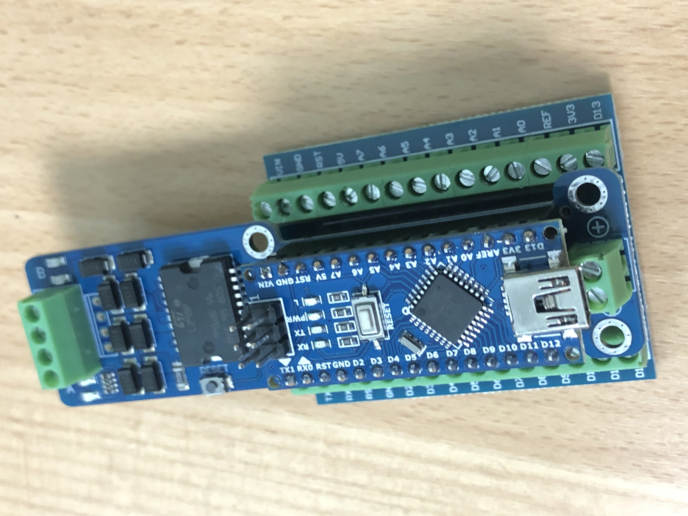

# Nano Motorsteuerung

Die Nano Motorsteuerung erlaubt die Ansteuerung von 2 Gleichstrommotoren durch einen Microcontroller. Der Microcontroller ist im Set enthalten und kompatibel zu einem Arduino Nano.
Das Set wurde speziell zur Steuerung von Stokys - Modellen zusammengestellt.  

  
  

 
 

# Anleitung zu dieser Webseite

## Herunterladen aller Dateien
Rechts oben kann unter **Code** mit **Download ZIP** das ganze Repository als ZIP-Datei heruntergeladen werden.
 
 
## Herunterladen / anzeigen der Dokumentantion
Das Dokument **NanoMotorsteuerung.pdf** enthält die Anleitung zur Verwendung und Programmierung des Moduls.
 
 
## Programmbeispiele
In den Beispielen sind die in der Dokumentation besprochenen Programme als Quelltext zu finden. 