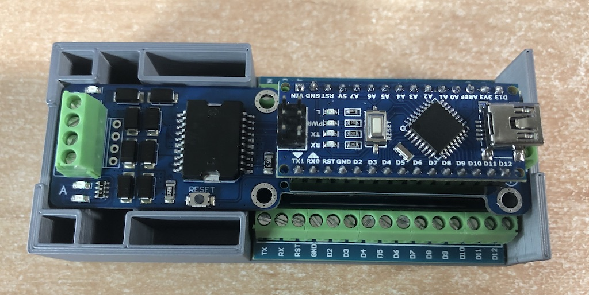
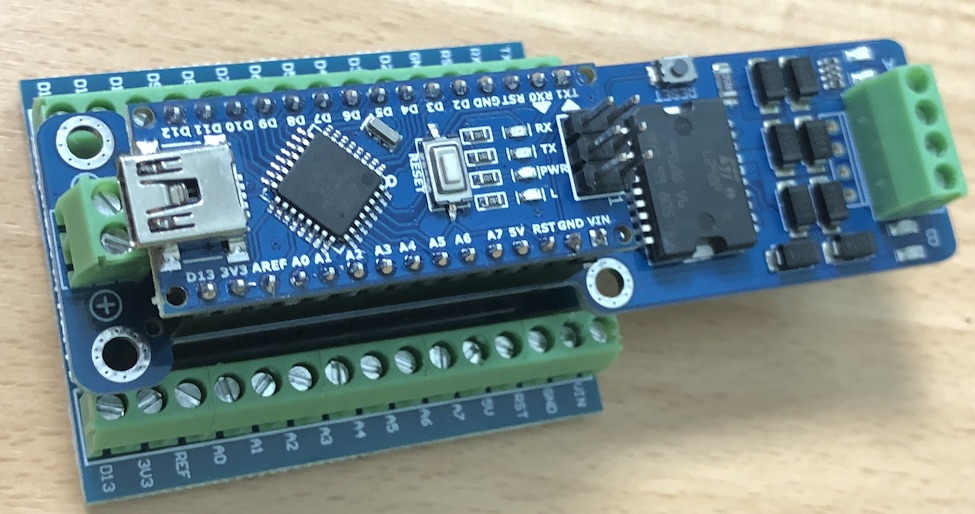
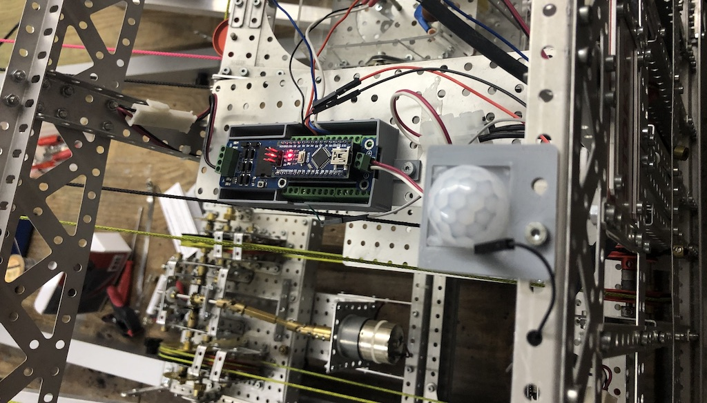
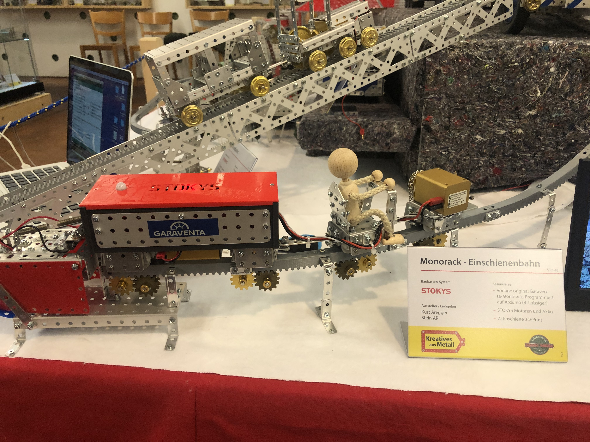

# Nano Motorsteuerung

Die Nano Motorsteuerung erlaubt die Ansteuerung von 2 Gleichstrommotoren durch einen Microcontroller. Der Microcontroller ist im Set enthalten und kompatibel zu einem Arduino Nano.
Im Set befindet sich auch eine Halterung, die den bequemen Einbau der Steuerung in ein Stokys - Modell erlaubt. Diese Halterung kann selbst nachgedruckt werden, das .stl - File ist im Verzeichnis stl zu finden.

Das Set wurde speziell zur Steuerung von Stokys - Modellen zusammengestellt.  

  
  
   
  
  

 

 
Diese Steuerung erfordert grundlegende Arduino - Kenntnisse. Falls diese fehlen, steht dir mein Arduino - Kurs auf Youtube kostenlos zur Verfügung.

https://www.youtube.com/playlist?list=PL4dxj1rGc3b29m2h3-0wUUTNVDoM5MmnJ
https://github.com/hobbyelektroniker/Arduino_Einstieg
 
 

# Anleitung zu dieser Webseite

## Herunterladen aller Dateien
Rechts oben kann unter **Code** mit **Download ZIP** das ganze Repository als ZIP-Datei heruntergeladen werden.
 
 
## Herunterladen / anzeigen des Handbuchs
Das Dokument **NanoMotorsteuerung.pdf** enthält die Anleitung zur Verwendung und Programmierung des Moduls.
 
 
## Programmbeispiele
Im Verzeichnis *Beispiele* sind die in der Dokumentation besprochenen Programme als Quelltext zu finden.
 
 
## 3D Druckteile
Die stl - File zu den gedruckten 3D - Teilen sind im Verzeichnis *stl* zu finden.  
